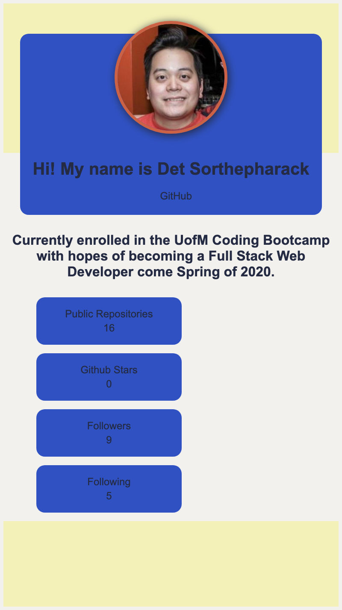

# developer-profile-generator
Homework #9

Welcome to the Developer Profile Generator. 

This application allows you to search GitHub for a user profile and generates a styled HTML page as well as a styled PDF.
The profile includes a link to the user's GitHub profile as well as a bio picture.
It also includes public repositories, followers, GitHub stars and following count.
The user also gets to choose their own color for their background theme.

Technologies/Languages Used:
Inquirer / Axios / Puppeteer / Javascript / CSS / HTML

How To Use The App:
1. Clone the repo from https://github.com/Dsorthep/developer-profile-generator
2. Install the modules 
3. Open index.js in Terminal, node index.js
4. Enter a GitHub profile name and favorite color 
5. Your profile will generate an HTML and PDF

Included in the repo is a gif demo and image.

